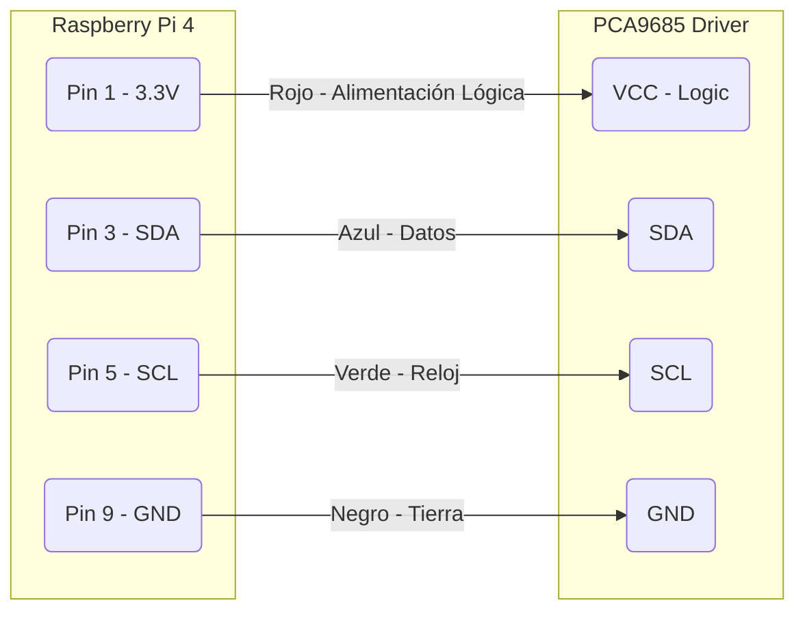
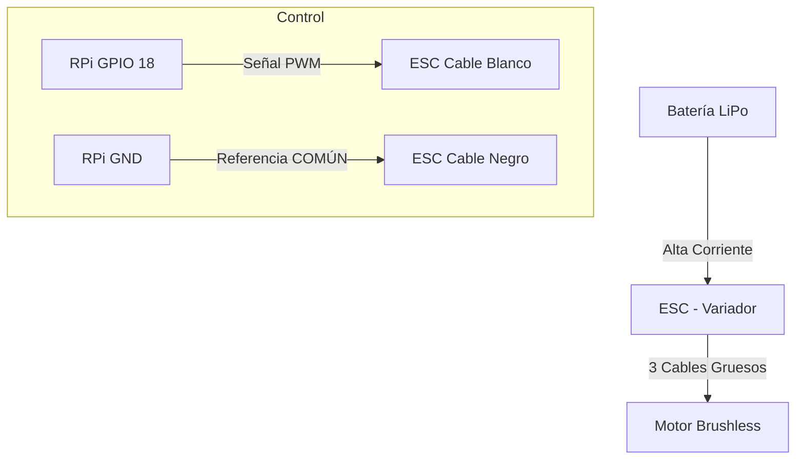

# Tutorial de Montaje y Conexiones Físicas
> [!IMPORTANT]
> **SEGURIDAD ANTE TODO**: Antes de manipular cables, asegúrate de que **todas las baterías estén desconectadas**. Un cortocircuito con una batería LiPo puede ser peligroso.

Este documento te guiará paso a paso para conectar los componentes físicos de tu barco (Raspberry Pi, Motores, Servos) según la configuración de tu software.

## Resumen de Conexiones

| Componente | Conexión Lógica | Conexión Física |
| :--- | :--- | :--- |
| **Controlador de Servos** | I2C Bus | Pines 3 (SDA) y 5 (SCL) de la Raspberry Pi |
| **Motor Principal** | PWM0 | Pin GPIO 18 (Pin 12 físico) de la Raspberry Pi |
| **Timón Central** | Canal 0 | Puerto 0 en la placa PCA9685 |
| **Cámara PTZ** | Canal 1 & 2 | Puertos 1 y 2 en la placa PCA9685 |
| **Torretas** | Canales 4, 5, 6, 7 | Puertos 4 al 7 en la placa PCA9685 |
| **Disparo Torretas** | GPIO Actuators | Pines GPIO 22 y 23 |

---

## 1. El Cerebro: Raspberry Pi <-> PCA9685
La placa PCA9685 permite controlar hasta 16 servos usando solo 2 pines de la Raspberry Pi.

> [!CAUTION]
> **NUNCA** alimentes los servos directamente desde los pines de 5V de la Raspberry Pi. La corriente que consumen quemará la placa. La PCA9685 debe recibir alimentación externa para los servos (borne verde).

### Diagrama de Conexión I2C
Conecta los siguientes pines de la Raspberry Pi (RPi) a los pines laterales de la PCA9685:




---

## 2. Propulsión: Motor Brushless y ESC
El motor principal se maneja directamente desde la Raspberry Pi usando una señal PWM en el **GPIO 18**.

> [!NOTE]
> El ESC (Electronic Speed Controller) tiene un cable tipo servo (3 hilos).
> *   **Blanco/Naranja**: Señal (Va al GPIO 18)
> *   **Rojo**: 5V (Normalmente **NO** se conecta a la Pi si la Pi ya tiene su propia fuente, para evitar conflictos de voltaje. **Corta o desconecta el cable rojo del medio si dudas**).
> *   **Negro/Marrón**: Tierra (GND). **CRÍTICO**: Debe estar conectado al GND de la Pi para cerrar el circuito.


### Diagrama de Propulsión



---

## 3. Conexión de Servos y Actuadores
Todos los servos (Timones, Cámaras, Torretas) se conectan a la placa PCA9685.

### Identificación de Cables del Servo
Asegúrate de conectarlos en la orientación correcta. El cable más oscuro (Marrón/Negro) siempre va hacia el exterior (GND), y el cable de color vivo (Naranja/Amarillo) hacia el interior (PWM).


### Mapa de Puertos (Según tu `config/componentes.py`)

Conecta tus servos en las siguientes posiciones numéricas impresas en la placa PCA9685:

| Puerto PCA9685 | Función Asignada | Descripción |
| :---: | :--- | :--- |
| **0** | `timon_central` | Servo principal de dirección. |
| **1** | `camara_ptz` (Pan) | Movimiento Horizontal de la cámara. |
| **2** | `camara_ptz` (Tilt) | Movimiento Vertical de la cámara. |
| **3** | *Libre* | Disponible para expansión. |
| **4** | `torreta_proa` (Giro) | Rotación de la torreta delantera. |
| **5** | `torreta_proa` (Elev) | Elevación del cañón delantero. |
| **6** | `torreta_popa` (Giro) | Rotación de la torreta trasera. |
| **7** | `torreta_popa` (Elev) | Elevación del cañón trasero. |

---

## 4. Funciones Especiales (Disparo / Láser)
Para activar dispositivos On/Off como láseres o sistemas de disparo, usamos pines GPIO digitales directos.

*   **Torreta Proa (Disparo)**: Conectar al **GPIO 22** (Pin físico 15).
*   **Torreta Popa (Disparo)**: Conectar al **GPIO 23** (Pin físico 16).

Se recomienda usar un módulo de **Relé** o un **Transistor MOSFET** si el dispositivo consume más de 20mA. **No conectes motores o bobinas directamente a estos pines**.

---

## 5. Resumen de Alimentación
Un esquema robusto para evitar que la Raspberry Pi se reinicie cuando los motores aceleran:

```mermaid
graph TD
    LIPO[Batería LiPo Principal]
    
    LIPO -->|Distibuidor de Corriente| ESC_MOTOR[ESC Motor Principal]
    LIPO -->|Distibuidor de Corriente| BEC_UBEC[BEC Externo 5V/3A]
    
    BEC_UBEC -->|5V Estables| PCA_PWR[PCA9685 - Borne Verde (Alimentación Servos)]
    
    BAT_USB[PowerBank o Fuente USB-C] -->|5V Independientes| RPI_PWR[Raspberry Pi USB-C]
    
    note[NOTA: Es mejor alimentar la Pi con una batería independiente (PowerBank) <br/>para evitar ruido eléctrico de los motores.]
```

¡Con esto tu hardware debería estar listo para funcionar con el software del barco!
