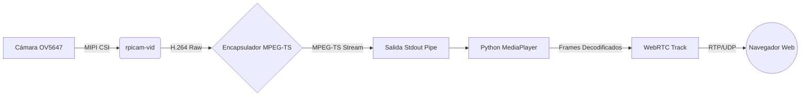

# Documentación: Sistema de Visión y Video

Esta sección detalla la configuración de la cámara, codificación de video y estrategias de baja latencia utilizadas en el vehículo.

## Hardware de Cámara

*   **Modelo**: Módulo compatible con Raspberry Pi Camera v1.3 / v2
*   **Sensor**: **OV5647**
*   **Lente**: Gran Angular ("Ojo de Pez") 175°
*   **Enfoque**: Manual (ajustable girando la lente).
*   **Resolución Nativa del Sensor**: 2592 x 1944 píxeles.

## Configuración de Captura de Video (`rpicam-vid`)

Utilizamos `rpicam-vid` (la pila moderna de `libcamera`) para capturar y codificar video en tiempo real.

### Resolución y FOV
Para evitar el recorte de imagen (efecto "zoom") causado por el formato 16:9, utilizamos una resolución con relación de aspecto **4:3** que coincide con el sensor físico.

*   **Resolución**: **1296 x 972** (Binning 2x2 del sensor completo).
*   **Resultado**: Utiliza la totalidad del sensor, proporcionando el campo de visión (FOV) completo de 175°.

### Calidad y Bitrate
Se ha optimizado para un equilibrio entre alta definición y rendimiento de red.

*   **Codec**: H.264 (perfil High) encapsulado en **MPEG-TS**.
*   **Bitrate**: **3 Mbps** (3,000,000 bits/s).
    *   *Nota*: 6 Mbps proporcionaba mayor calidad visual pero saturaba el CPU de la Raspberry Pi durante la encriptación WebRTC, causando latencia acumulativa (drift). 3 Mbps es el "punto dulce".
*   **Framerate**: 30 FPS.

## Estrategia de Baja Latencia ("Zero Latency")

Para el control remoto, la latencia debe ser < 200ms. Se han aplicado optimizaciones agresivas en toda la tubería:

### 1. En el Emisor (`rpicam-vid`)
*   `--low-latency 1`: Activa presets de baja latencia en el codificador `libav`.
*   `--flush`: Fuerza la escritura inmediata de datos al tubo de salida (pipe), sin esperar a llenar bloques.
*   `--g 10`: Tamaño de GOP (Group of Pictures). Se envía un cuadro maestro (iframe) cada 10 cuadros (0.33 segundos). Esto permite que el video se recupere casi instantáneamente si se pierde un paquete en WiFi.

### 2. En el Receptor (`MediaPlayer` de Python)
*   `fflags: nobuffer`: Deshabilita el buffer de entrada de FFmpeg.
*   `flags: low_delay`: Indica al decodificador que sacrifique corrección de errores por velocidad.
*   `max_delay: 0`: Configuración crítica. Si el procesador no alcanza a decodificar a tiempo, **descarta** los cuadros viejos en lugar de encolarlos. Esto previene el efecto "Matrix" (video en cámara lenta) cuando la red fluctúa.

## Pipeline de Software

